# Data Exploration in SQL 

## Coronavirus (COVID-19) Deaths
Data Source : Our World in Data 

## Introduction
This is a SQL project done using Microsoft SQL Server managament studio. I did a few analysis of the dataset where I displayed a few of my SQL skills. I want the numbers for deaths for each countries, what percentage of people were vaccinated and more using SQL querties. There are two tables in this project: **CovidDeaths and CovidVaccinations**. I try to detail every step I took,  hopefully you find it interesting. 

## Problem Statment

1.	What is the percentage of total deaths to total case to total cases.
2.	What is the total cases vs population in percentages in the UK
3.	What is the total cases vs population also in percentages in the UK
4.	Countries with highest infection rate based on population
5.	countries with highest deaths
6.	Global numbers
7.	Join the two tables
8.	Total population vs vaccination in each country
9.	Create a view

## Skills/ concepts demostrated:

In this project, a few SQL features were incoporated: 
-Create Table, Group by,  Order by, Temp Table, Join, Create View and more. 

## Solution

- ### CovidDeaths and CovidVaccinations Tables,

Covid Death                            |    Covid Vaccinations
:--------------------------------------|:--------------------------:
              | 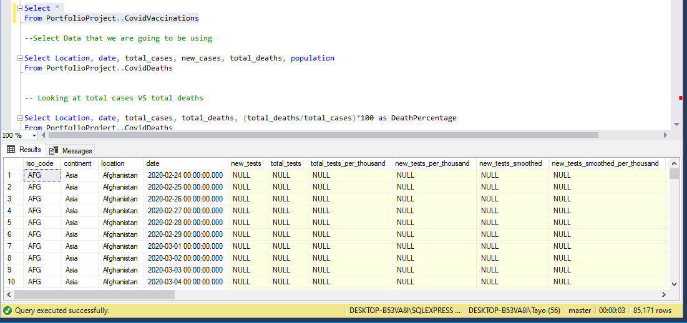

- ### What is the percentage of total deaths to total case to total cases,

  This is from the **CovidDeathsTable** I did the following: 
  
        Select Location, date, total_cases, total_deaths, (total_deaths/total_cases)*100 as DeathPercentage
        From PortfolioProject..CovidDeaths
        order by 1,2
 
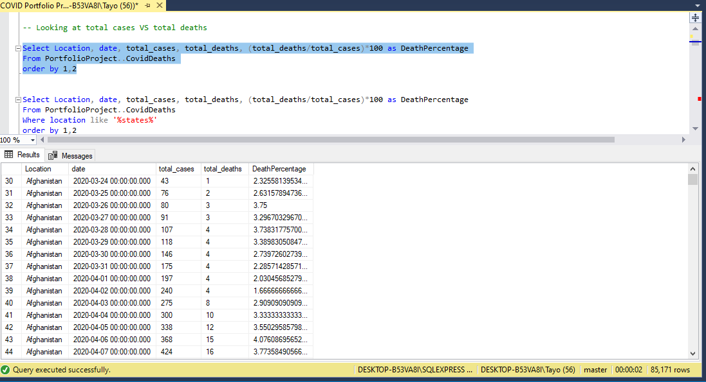

- ### What is the total cases vs population in percentages in the UK,

Also from the **CovidDeathsTable**, I did the same thing as earlier, only this time, I did the query for just the United Kingdom

        Select Location, date, total_cases, total_deaths, (total_deaths/total_cases)*100 as DeathPercentage
        From PortfolioProject..CovidDeaths
        Where location like '%united kingdom%'
        order by 1,2

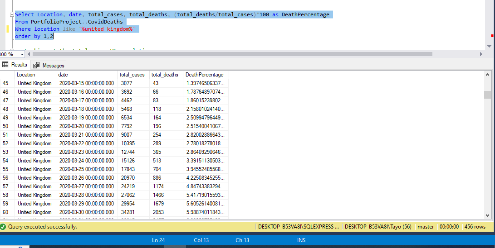

- ### What is the total cases vs population also in percentages in the UK,

The caldulation here is (total_cases/population)*100

        Select Location, date, population, total_cases, (total_cases/population)*100 as PopulationWithCovid
        From PortfolioProject..CovidDeaths
        Where location like '%Kingdom%'
        order by 1,2

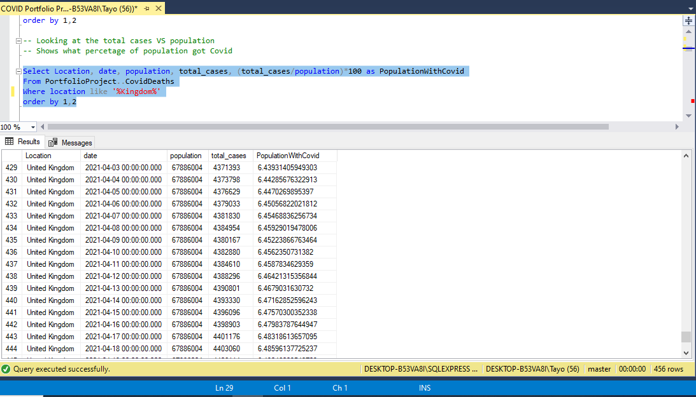

- ### Countries with highest infection rate based on population,

Here I am checking the countries with highest infection rate based on population. This is where I used the GROUP BY.

        Select Location, population, MAX(total_cases) as HighestInfectedCountry, MAX((total_cases/population))*100 as PercentPopulationInfected
        From PortfolioProject..CovidDeaths
        Group by Location, population
        order by PercentPopulationInfected desc

  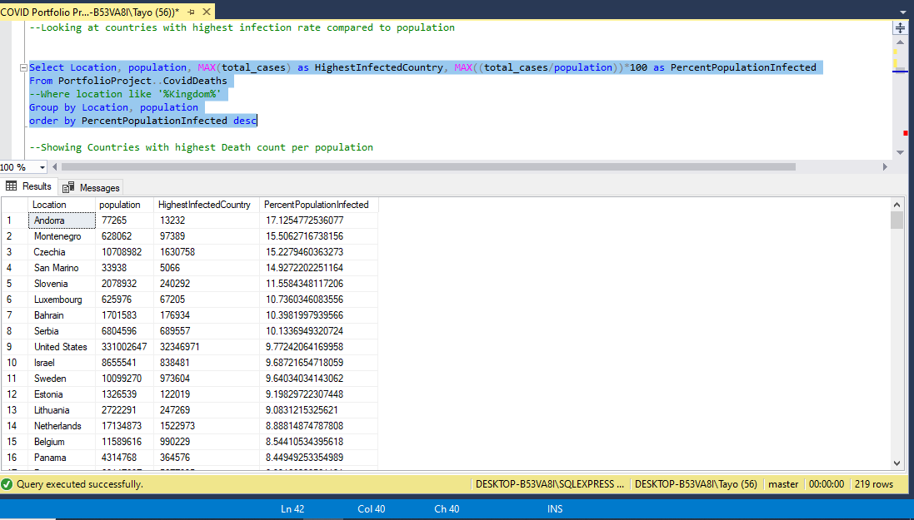

- ### Countries with highest deaths,

Here I checked total number of deaths per country. 

        Select Location, MAX(cast(Total_Deaths as int)) as TotalDeathCount
        From PortfolioProject..CovidDeaths
        Where continent is not null
        Group by Location
        order by TotalDeathCount desc

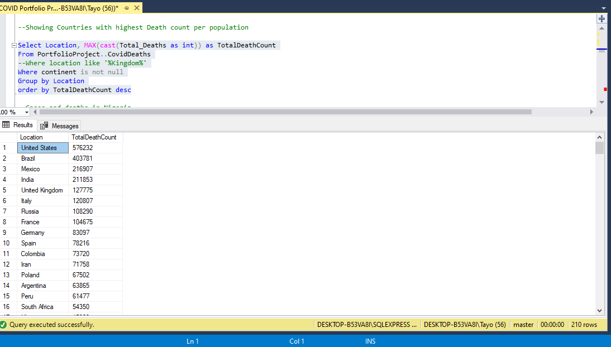

- ### Global numbers,

Here I am looking for the total number of cases, total number of deaths globaly and the death percentage

        Select SUM(new_cases) as total_cases, SUM(cast(new_deaths as int)) as total_deaths, SUM(cast(new_deaths as int))/SUM(new_cases)*100 as DeathPercentage
        From PortfolioProject..CovidDeaths
        where continent is not null
        order by 1,2
        

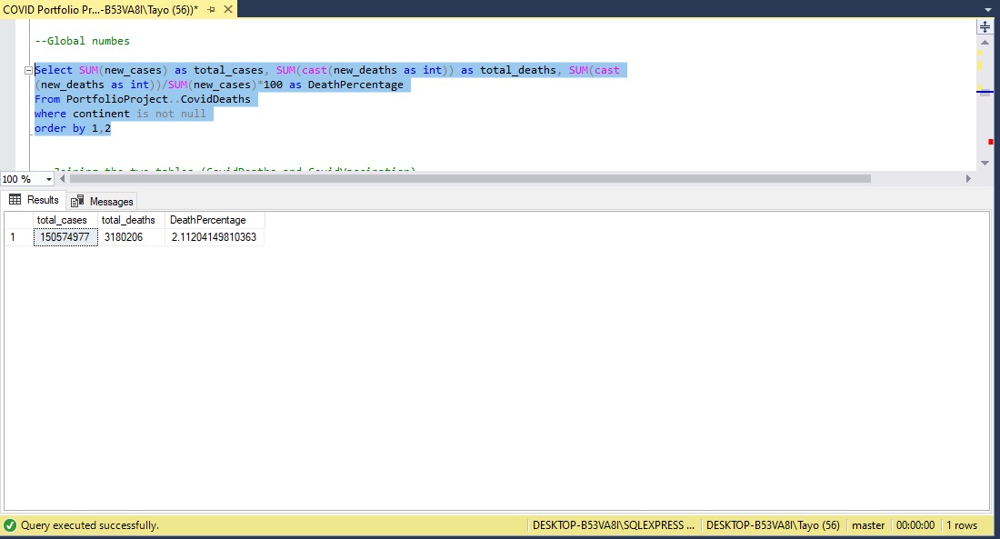

- ### Join the two tables,

Here I am joing the **CovidDeaths and CovidVaccinations Tables** together based on their relationships.

        Select *
        From PortfolioProject..CovidDeaths dea
        join PortfolioProject..CovidVaccinations vac
          on dea.location = vac.location
          and dea.date = vac.date

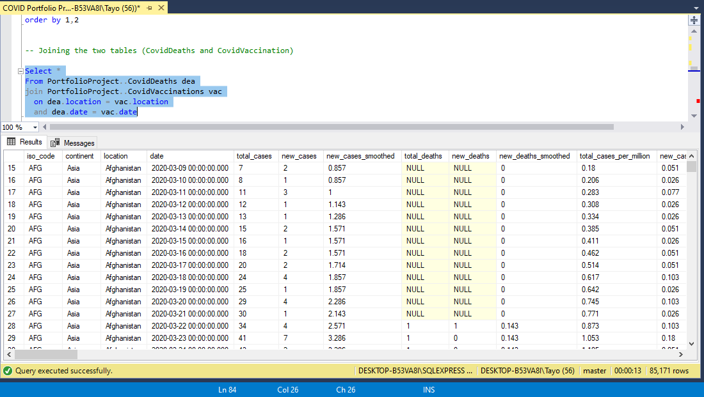

- ### Percentage of Total population vs vaccination in each country

This is based on the joined tables, here is where the Temp Table comes in, first I need to know total number of people vaccinated in each country. To get that, I did the following and name the column **RollingPeopleVaccinated**

        select dea.continent, dea.location, dea.date, dea.population, vac.new_vaccinations
           , SUM (CONVERT(int,vac.new_vaccinations)) OVER (partition by dea.Location Order by dea.location, dea.date) as RollingPeopleVaccinated
          From PortfolioProject..CovidDeaths dea
          join PortfolioProject..CovidVaccinations vac
          on dea.location = vac.location
          and dea.date = vac.date
          where dea.continent is not null
          order by 2,3

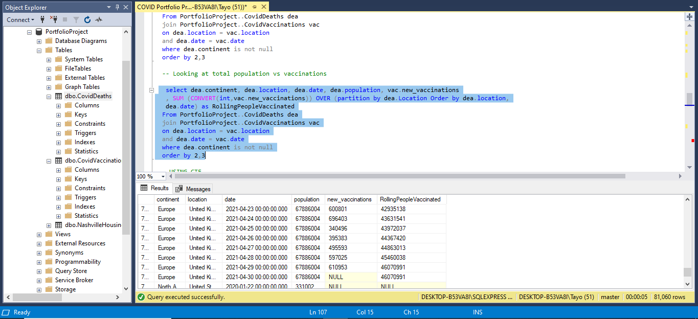

After creating the column, I need to create a TEMP TABLE, I call the table **PercentPopulationVaccinated**. And the calculation I did waas (RollingPeopleVaccinated/population)*100

        DROP Table if exists #PercentPopulationVaccinated
          create table #percentpopulationvaccinated 
          (
          Continent nvarchar(255),
          Location nvarchar(255),
          Date datetime,
          Population numeric,
          New_vaccinations numeric,
          Rollingpeoplevaccinated numeric
          )
        
          insert into #percentpopulationvaccinated
          select dea.continent, dea.location, dea.date, dea.population, vac.new_vaccinations
           , SUM (CAST(vac.new_vaccinations as int)) OVER (partition by dea.Location Order by dea.location, dea.date) as RollingPeopleVaccinated
          From PortfolioProject..CovidDeaths dea
          join PortfolioProject..CovidVaccinations vac
          on dea.location = vac.location
          and dea.date = vac.date
          order by 2,3
        
        
          select*, (RollingPeopleVaccinated/Population)*100
          From #percentpopulationvaccinated

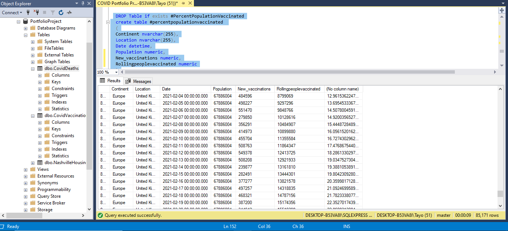

- ### Create a view
Here I am creating a view for visualisation later: 

        Create View percentpopulationvaccinated as
           select dea.continent, dea.location, dea.date, dea.population, vac.new_vaccinations
           , SUM (CONVERT(int,vac.new_vaccinations)) OVER (partition by dea.Location Order by dea.location,
           dea.date) as RollingPeopleVaccinated
          From PortfolioProject..CovidDeaths dea
          join PortfolioProject..CovidVaccinations vac
          on dea.location = vac.location
          and dea.date = vac.date
          where dea.continent is not null
        
          Select*
          From percentpopulationvaccinated

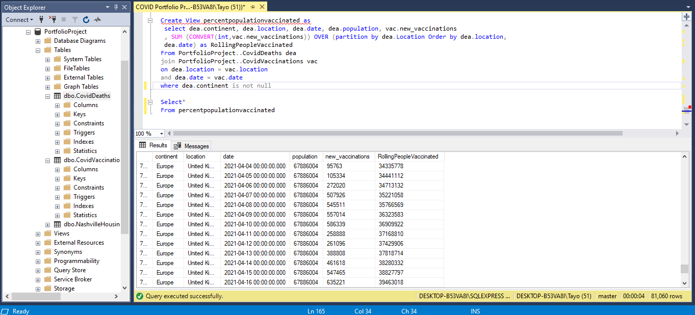

## Summary

In this project, I have used alot of SQL features to get informations about COVID-19. 
